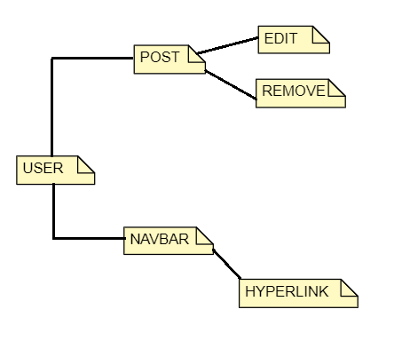
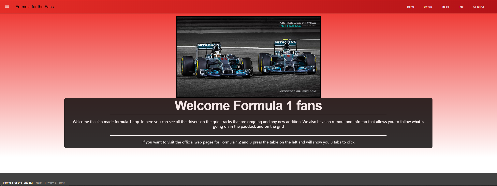
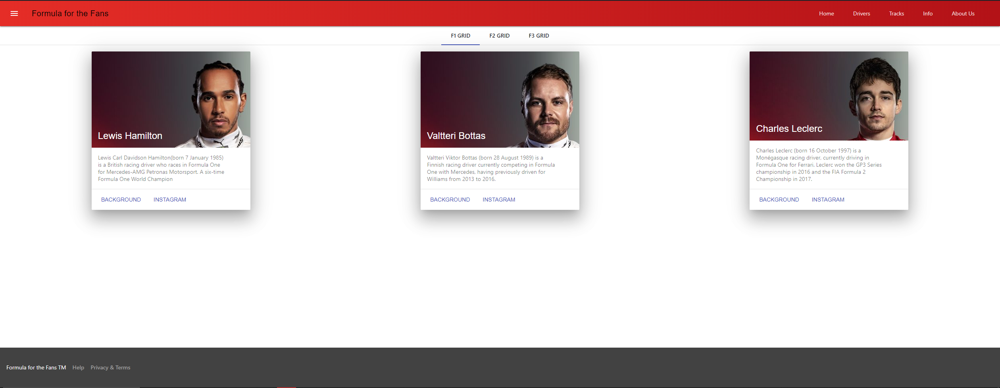
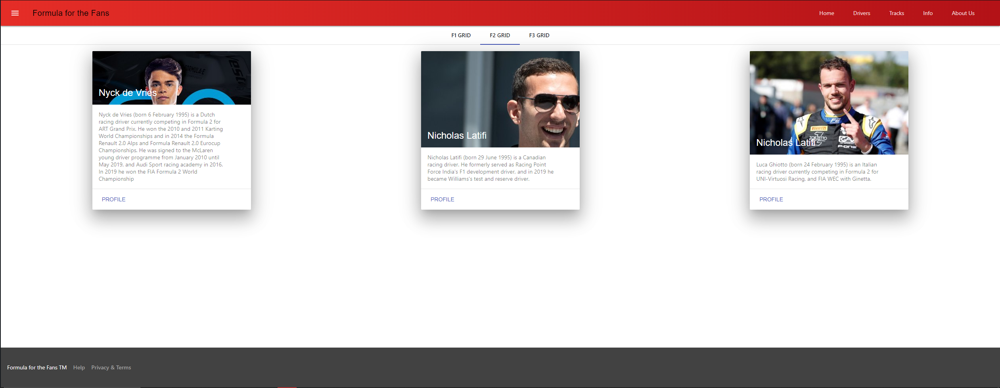
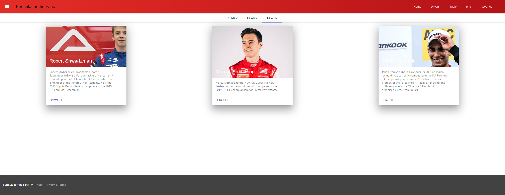
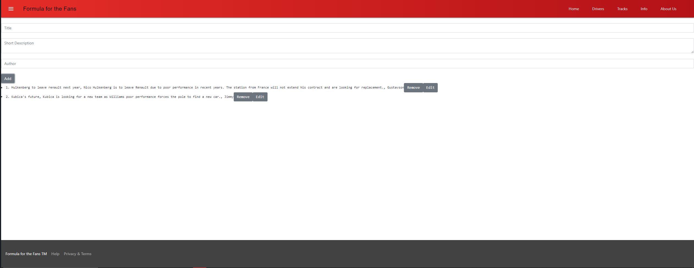
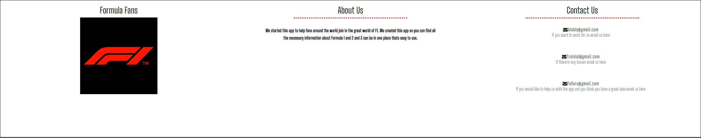
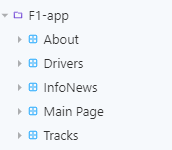

# BSc (Hons.) Level 8 - Assignment 1 - Single Page app.

Name: Kasper Gutkowski

## Overview.

The concept of the app is a fan based app for f1 and f2 and f3. I tried to create a place were fans can see their
favourite driver or read about a certain grand prix. You also can contact the devs using the emails provided and add news info 
and remove and edit them.

. . . . . List of user features  . . . .

- Navigate through the navbar
- Adding info
- Removing info
- Edit info
- Access through Links
- Responsive Footer with links

## Setup.

Starting of I set up a folder were all the files would be stored. Once that was done I used creat app function in the cmd
that created and imported all the files necessary. Once the basic app was created the files necessary to create a single page app.
Once all the js files were created and storybook imported im procedded with coding.

## Data Model Design.

~~~
 <Cell col={4}>
     <h2>About Us</h2>
         

         
We started this app to help fans around the world join in
         the great world of F1. We created this app so you can find all the necessary
          information about Formula 1 and 2 and 3 can be in one place thats easy to use.
    

</Cell>

 <Card shadow={6} style={{width: '400px', height: '400px', margin: 'auto'}}>
                    <CardTitle expand style={{color: '#fff', background: 'url(https://www.formula1.com/content/fom-website/en/drivers/lewis-hamilton/_jcr_content/image.img.640.medium.jpg/1554818913486.jpg'}}>Lewis Hamilton</CardTitle>
                    <CardText>
                        Lewis Carl Davidson Hamilton(born 7 January 1985) is a British racing driver who races 
                        in Formula One for Mercedes-AMG Petronas Motorsport. A six-time Formula One World Champion
                    </CardText>
                    <CardActions border>
                        <a href="https://en.wikipedia.org/wiki/Lewis_Hamilton" rel="noopener noreferrer" target="_blank"><Button colored>Background</Button></a>
                        <a href="https://www.instagram.com/lewishamilton/?hl=pl" rel="noopener noreferrer" target="_blank"><Button colored>Instagram</Button></a>
                    </CardActions>
                </Card>

EditInfo = (i)=>{
        let info = this.state.news[i];
        this.refs.title.value = info.title;
        this.refs.title.value = info.shortdescription;
        this.refs.title.value = info.author;
        
        this.setState({
            act: 1,
            index: i
        })

        this.refs.title.focus();
    }

~~~
## UI Design.

>> Shows the main page of of app. Clear view of the navbar and main image and intro to everyone visiting.

>> Shows the drivers grid for F1 with links to their backgrounds and instagrams.

>>Shows the drivers grid for F2 with links to their backgrounds and instagrams.

>>Shows the drivers grid for F3 with links to their backgrounds and instagrams.

>> Shows the info page were users can add to a list all infos, questions, discutions and rumours they wish.

>> Shows the main page of of app. Clear view of the navbar and main image and intro to everyone visiting.

>> Shows the about page with the f1 image. It talks about who the devs our so the user can get a feel for who they are. It also shows contact details that a fan or potential worker can contact the team.

## Routing.

- /Drivers (public)- displays drivers on the current grid.
- /Tracks (public) - displays all the tracks available in f1.
- /InfoNews (public)- display all articles by a specific author.
- /About (public)- displays contact and about us information.

## Storybook.

## Independent learning.

I used React-MDL and reactstrap to style my webpage. I used a tutorial online for CRUD adding, removing and editing. I also used stackoverflow for some code parts.

(model): ./img/model.PNG
(main): ./img/main.PNG
(detail): ./img/detail.PNG
(stories): ./img/stories.PNG

